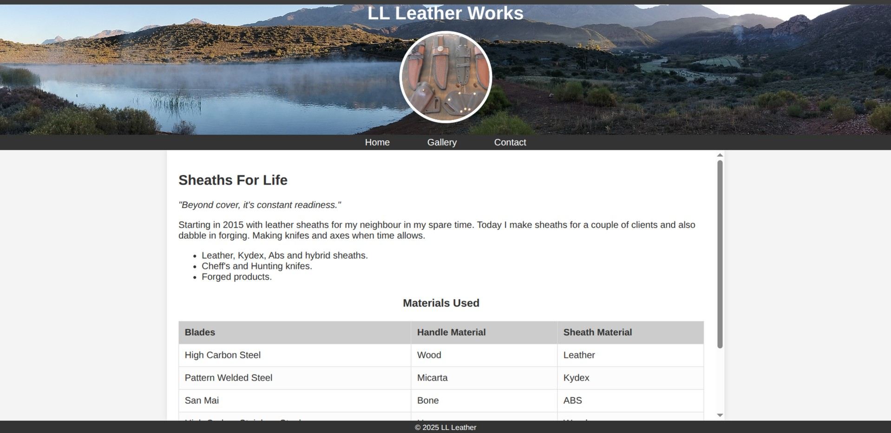

# LL Leather Works

## A Showcase of Bespoke Leathercraft, Blades, and Forged Artistry

This repository hosts the front-end code for **LL Leather Works**, a dedicated online platform showcasing exquisite handmade leather products, custom knives, and unique forged items. The website serves as a digital portfolio, allowing potential clients to explore the craftsmanship, understand the materials used, and easily get in touch for custom orders. Its importance lies in providing a professional and accessible online presence for a skilled artisan, bridging the gap between intricate handmade goods and a broader audience. It aims to highlight the passion and precision that goes into every item, from custom sheaths to forged axes, establishing LL Leather Works as a go-to source for high-quality, bespoke creations.

## Table of Contents

-   [Features](#features)
-   [Technologies Used](#technologies-used)
-   [Installation](#installation)
-   [Usage](#usage)
-   [File Structure](#file-structure)
-   [Customization](#customization)
-   [Credits](#credits)
-   [Contact](#contact)
-   [License](#license)

## Features

-   **Responsive Design**: The website is meticulously designed to be accessible and visually appealing across a wide range of devices, from desktops to mobile phones, ensuring an optimal viewing experience for all users.
-   **Home Page (`index.html`)**: This introductory page provides an overview of LL Leather Works, detailing its origins, the types of products offered (leather, kydex, ABS, hybrid sheaths; chef's and hunting knives; forged products), and a comprehensive table of materials used for blades, handles, and sheaths. It also includes direct links for contact via phone and Facebook.
-   **Gallery Page (`gallery.html`)**: A dedicated section to visually showcase the diverse range of products through high-quality images and descriptive captions. It highlights various creations, including chef knife stands, leather knife rolls, tooled leather sheaths, custom knives, and forged axes.
-   **Contact Page (`contact.html`)**: Facilitates easy communication with LL Leather Works through a user-friendly contact form. Users can inquire about specific interests (leather, knives, or forged products) and send detailed messages.
-   **Consistent Navigation**: A clear and intuitive navigation bar allows users to seamlessly move between the Home, Gallery, and Contact sections.
-   **Fixed Header and Footer**: A cohesive design element featuring the LL Leather Works name and profile image in a fixed header, along with consistent copyright information in a fixed footer, maintaining brand presence throughout the user experience.
-   **SCSS for Styling**: Utilizes SCSS (Sass) for efficient and organized styling, employing variables for easy theming and maintainability, ensuring a clean and scalable codebase.

## Technologies Used

-   **HTML5**: The foundational language used to structure the content and layout of all web pages, ensuring semantic and accessible markup.
-   **SCSS (Sass)**: Employed as a CSS pre-processor, enabling the use of variables, nested rules, mixins, and functions to create a more efficient, maintainable, and modular stylesheet.
-   **CSS3**: The styling language applied to `style.css` (compiled from `style.scss`) to define the visual presentation, layout, and responsiveness of the website.

## Installation

To set up and run this project locally, please follow these steps:

1.  **Clone the Repository**:
    Begin by cloning the project repository to your local machine using Git:
    ```bash
    git clone https://github.com/leo202514/LL-Leather-Works.git
    ```
   
2.  **Navigate to the Project Directory**:
    Change your current directory to the newly cloned project folder:
    ```bash
    cd LL-Leather-Works
    ```

3.  **Install Sass (if not already installed)**:
    This project uses SCSS, which needs to be compiled into standard CSS. If you don't have Sass installed globally, you can install it via npm (Node Package Manager) or Yarn:
    ```bash
    npm install -g sass
    # OR if you prefer Yarn:
    yarn global add sass
    ```
    Ensure Node.js and npm/Yarn are installed on your system if you choose this method.

## Usage

Once the project is installed and Sass is set up, you can compile the styles and view the website:

1.  **Compile SCSS to CSS**:
    Open your terminal or command prompt in the `LL-Leather-Works` project root directory. Run the following command to compile the `style.scss` file into `css/style.css`:
    ```bash
    sass style.scss css/style.css
    ```
    For continuous compilation during development (recommended), use the `--watch` flag. This will automatically recompile `style.css` every time you save changes to `style.scss`:
    ```bash
    sass --watch style.scss:css/style.css
    ```

2.  **Open the HTML Files**:
    You can now open any of the HTML files (`index.html`, `gallery.html`, or `contact.html`) directly in your web browser. Simply navigate to the file in your file explorer and double-click it, or drag and drop it into your browser.

    ### Screenshots of the Project in Action:

    #### Home Page:
   
   
    #### Gallery Page:
    *(Please imagine a screenshot here showing a grid of images from the `gallery.html` page, displaying various leather items, knives, and the axe.)*

    #### Contact Page:
    *(Please imagine a screenshot here showing the `contact.html` page with the "Contact Us" heading, the introductory paragraph, and the contact form with input fields and radio buttons.)*

## File Structure

The project is organized into a clear and logical directory structure:

LL-Leather-Works/
├── css/
│   └── style.css          # The compiled CSS file generated from style.scss
├── images/
│   ├── header-background.jpg # The background image used in the main header
│   ├── header-overlay.jpg # The circular profile picture displayed in the header
│   ├── image1.jpg
│   ├── image2.jpg
│   ├── image3.jpg
│   ├── image4.jpg
│   ├── image5.jpg
│   ├── image6.jpg
│   ├── image7.jpg
│   ├── image8.jpg
│   └── image9.jpg         # Various images used for the gallery section
├── style.scss             # The main SCSS source file containing all styles for the website
├── index.html             # The main home page of the LL Leather Works website
├── gallery.html           # The page dedicated to showcasing product images
└── contact.html           # The page containing the contact form for user inquiries


## Customization

This project is designed with ease of customization in mind.

-   **Styling**: All visual styles are managed through `style.scss`. You can modify the look and feel by changing the defined SCSS variables at the top of the file:
    ```scss
    // Variables for easy theming
    $primary-color: #333;       // Main text and background color for navigation/footer
    $secondary-color: #555;     // Hover states and secondary elements
    $background-color: #f4f4f4; // General page background
    $text-color: #333;          // Default text color
    $white: #fff;               // White color for text on dark backgrounds
    $border-color: #ddd;        // Color for borders, e.g., tables
    $box-shadow: 0 0 10px rgba(0, 0, 0, 0.1); // Standard box shadow
    // Heights for layout adjustments
    $new-header-height: 225px;
    $nav-height: 25.6px;
    $footer-height: 25.2px;
    ```
    Further down in `style.scss`, you can adjust specific element styles, responsive breakpoints, and more. Remember to re-compile your SCSS after making changes.

-   **Content**: Update the textual content, links, and specific product descriptions by editing the respective HTML files (`index.html`, `gallery.html`, `contact.html`).

-   **Images**: Replace the existing image files within the `images/` directory with your own product photos, header backgrounds, or profile pictures. Ensure the file names in the HTML and CSS/SCSS (if directly referenced) are updated accordingly.

## Credits

This project was developed by:

* **Your Name/Your GitHub Username** - (Optional: Link to your GitHub profile or personal website)
    * Example: [John Doe](https://github.com/johndoe)

*(If there were other contributors, list them here with their respective links.)*

## Contact

We welcome your inquiries and feedback!

-   **Phone**: +27 (82) 324-7877
-   **Facebook**: [Find us on Facebook](https://www.facebook.com/share/1BaDvmUEWd/)
-   **Email/Form**: You can also reach us directly via the [Contact Form](contact.html) on our website.

## License

This project is open-sourced under the MIT License. See the `LICENSE` file (if you create one) for more details.

